```mermaid
erDiagram
    %% ==========================================
    %% REFERENCE TABLES
    %% ==========================================
    
    roles {
        INT id PK
        VARCHAR name UK
        VARCHAR description
        TIMESTAMP created_at
    }
    
    states {
        INT id PK
        VARCHAR code UK
        VARCHAR name
        TIMESTAMP created_at
    }
    
    suburbs {
        INT id PK
        VARCHAR name
        VARCHAR postcode
        INT state_id FK
        DECIMAL latitude
        DECIMAL longitude
        TIMESTAMP created_at
    }
    
    property_types {
        INT id PK
        VARCHAR name UK
        VARCHAR description
        TIMESTAMP created_at
    }
    
    property_statuses {
        INT id PK
        VARCHAR name UK
        VARCHAR description
        VARCHAR display_color
        TIMESTAMP created_at
    }
    
    features {
        INT id PK
        VARCHAR name UK
        VARCHAR category
        VARCHAR icon
        TIMESTAMP created_at
    }
    
    offer_statuses {
        INT id PK
        VARCHAR name UK
        VARCHAR description
        TIMESTAMP created_at
    }
    
    document_types {
        INT id PK
        VARCHAR name UK
        VARCHAR description
        BOOLEAN required_for_listing
        TIMESTAMP created_at
    }
    
    billing_plans {
        INT id PK
        VARCHAR name UK
        TEXT description
        DECIMAL price
        ENUM billing_type
        DECIMAL commission_rate
        JSON features
        BOOLEAN is_active
        TIMESTAMP created_at
    }

    %% ==========================================
    %% CORE TABLES
    %% ==========================================
    
    users {
        INT id PK
        VARCHAR email UK
        VARCHAR password_hash
        VARCHAR first_name
        VARCHAR last_name
        VARCHAR phone
        VARCHAR avatar_url
        BOOLEAN email_verified
        TIMESTAMP email_verified_at
        BOOLEAN is_active
        TIMESTAMP last_login_at
        TIMESTAMP created_at
        TIMESTAMP updated_at
    }
    
    user_roles {
        INT id PK
        INT user_id FK
        INT role_id FK
        TIMESTAMP assigned_at
        INT assigned_by FK
    }
    
    user_sessions {
        INT id PK
        INT user_id FK
        VARCHAR token_hash
        VARCHAR ip_address
        VARCHAR user_agent
        TIMESTAMP expires_at
        TIMESTAMP created_at
    }
    
    properties {
        INT id PK
        INT seller_id FK
        VARCHAR street_address
        VARCHAR unit_number
        INT suburb_id FK
        INT property_type_id FK
        INT status_id FK
        TINYINT bedrooms
        TINYINT bathrooms
        TINYINT car_spaces
        INT land_size
        INT building_size
        YEAR year_built
        DECIMAL price
        VARCHAR price_display
        BOOLEAN is_price_hidden
        DECIMAL ai_valuation_low
        DECIMAL ai_valuation_mid
        DECIMAL ai_valuation_high
        DECIMAL ai_demand_score
        TIMESTAMP ai_valuation_updated_at
        VARCHAR headline
        TEXT description
        INT views_count
        INT enquiries_count
        INT saves_count
        INT billing_plan_id FK
        TIMESTAMP listed_at
        TIMESTAMP expires_at
        TIMESTAMP sold_at
        DECIMAL sold_price
        TIMESTAMP created_at
        TIMESTAMP updated_at
    }
    
    property_images {
        INT id PK
        INT property_id FK
        VARCHAR url
        VARCHAR thumbnail_url
        VARCHAR alt_text
        TINYINT display_order
        BOOLEAN is_primary
        TIMESTAMP uploaded_at
    }
    
    property_features {
        INT id PK
        INT property_id FK
        INT feature_id FK
    }
    
    saved_properties {
        INT id PK
        INT user_id FK
        INT property_id FK
        TIMESTAMP saved_at
        TEXT notes
    }

    %% ==========================================
    %% OFFERS TABLES
    %% ==========================================
    
    offers {
        INT id PK
        INT property_id FK
        INT buyer_id FK
        DECIMAL offer_amount
        DECIMAL deposit_amount
        ENUM finance_type
        DECIMAL finance_amount
        VARCHAR finance_lender
        INT settlement_days
        DATE proposed_settlement_date
        INT status_id FK
        BOOLEAN is_counter_offer
        INT parent_offer_id FK
        DECIMAL counter_amount
        DECIMAL ai_confidence_score
        TIMESTAMP submitted_at
        TIMESTAMP viewed_at
        TIMESTAMP responded_at
        TIMESTAMP expires_at
    }
    
    offer_conditions {
        INT id PK
        INT offer_id FK
        VARCHAR condition_type
        TEXT description
        BOOLEAN is_satisfied
        TIMESTAMP satisfied_at
    }

    %% ==========================================
    %% INSPECTIONS TABLES
    %% ==========================================
    
    inspections {
        INT id PK
        INT property_id FK
        ENUM inspection_type
        DATE scheduled_date
        TIME start_time
        TIME end_time
        INT max_attendees
        TEXT notes
        ENUM status
        VARCHAR cancelled_reason
        TIMESTAMP created_at
        TIMESTAMP updated_at
    }
    
    inspection_attendees {
        INT id PK
        INT inspection_id FK
        INT user_id FK
        TIMESTAMP booked_at
        BOOLEAN attended
        TINYINT interest_level
        TEXT comments
    }

    %% ==========================================
    %% DOCUMENTS TABLES
    %% ==========================================
    
    documents {
        INT id PK
        INT property_id FK
        INT document_type_id FK
        INT uploaded_by FK
        VARCHAR file_name
        VARCHAR file_url
        INT file_size
        VARCHAR mime_type
        ENUM status
        INT reviewed_by FK
        TIMESTAMP reviewed_at
        VARCHAR rejection_reason
        TIMESTAMP uploaded_at
    }
    
    document_shares {
        INT id PK
        INT document_id FK
        INT shared_with_user_id FK
        INT shared_by_user_id FK
        TIMESTAMP shared_at
        TIMESTAMP expires_at
    }

    %% ==========================================
    %% MESSAGING TABLES
    %% ==========================================
    
    conversations {
        INT id PK
        INT property_id FK
        VARCHAR subject
        TIMESTAMP created_at
        TIMESTAMP updated_at
    }
    
    conversation_participants {
        INT id PK
        INT conversation_id FK
        INT user_id FK
        TIMESTAMP joined_at
        TIMESTAMP last_read_at
        BOOLEAN is_muted
    }
    
    messages {
        INT id PK
        INT conversation_id FK
        INT sender_id FK
        TEXT content
        BOOLEAN is_ai_generated
        BOOLEAN is_read
        TIMESTAMP read_at
        TIMESTAMP sent_at
        TIMESTAMP edited_at
    }
    
    message_attachments {
        INT id PK
        INT message_id FK
        VARCHAR file_name
        VARCHAR file_url
        INT file_size
        VARCHAR mime_type
        TIMESTAMP uploaded_at
    }

    %% ==========================================
    %% BILLING & SYSTEM TABLES
    %% ==========================================
    
    billing_transactions {
        INT id PK
        INT user_id FK
        INT property_id FK
        INT billing_plan_id FK
        DECIMAL amount
        VARCHAR currency
        ENUM payment_method
        VARCHAR payment_reference
        ENUM status
        TIMESTAMP created_at
        TIMESTAMP completed_at
    }
    
    notifications {
        INT id PK
        INT user_id FK
        VARCHAR type
        VARCHAR title
        TEXT message
        JSON data
        VARCHAR action_url
        BOOLEAN is_read
        TIMESTAMP read_at
        TIMESTAMP created_at
    }
    
    audit_logs {
        INT id PK
        INT user_id FK
        VARCHAR action
        VARCHAR entity_type
        INT entity_id
        JSON old_values
        JSON new_values
        VARCHAR ip_address
        VARCHAR user_agent
        TIMESTAMP created_at
    }

    %% ==========================================
    %% RELATIONSHIPS
    %% ==========================================
    
    %% Reference Relationships
    states ||--o{ suburbs : "has"
    
    %% User Relationships
    users ||--o{ user_roles : "has"
    roles ||--o{ user_roles : "assigned_to"
    users ||--o{ user_sessions : "has"
    users ||--o{ user_roles : "assigns"
    
    %% Property Relationships
    users ||--o{ properties : "sells"
    suburbs ||--o{ properties : "located_in"
    property_types ||--o{ properties : "categorizes"
    property_statuses ||--o{ properties : "has_status"
    billing_plans ||--o{ properties : "uses"
    
    %% Property Multi-valued Relationships (4NF)
    properties ||--o{ property_images : "has"
    properties ||--o{ property_features : "has"
    features ||--o{ property_features : "describes"
    properties ||--o{ saved_properties : "saved_by"
    users ||--o{ saved_properties : "saves"
    
    %% Offer Relationships
    properties ||--o{ offers : "receives"
    users ||--o{ offers : "makes"
    offer_statuses ||--o{ offers : "has_status"
    offers ||--o{ offers : "counters"
    offers ||--o{ offer_conditions : "has"
    
    %% Inspection Relationships
    properties ||--o{ inspections : "has"
    inspections ||--o{ inspection_attendees : "has"
    users ||--o{ inspection_attendees : "attends"
    
    %% Document Relationships
    properties ||--o{ documents : "has"
    document_types ||--o{ documents : "categorizes"
    users ||--o{ documents : "uploads"
    users ||--o{ documents : "reviews"
    documents ||--o{ document_shares : "shared"
    users ||--o{ document_shares : "shared_with"
    users ||--o{ document_shares : "shared_by"
    
    %% Messaging Relationships
    properties ||--o{ conversations : "about"
    conversations ||--o{ conversation_participants : "has"
    users ||--o{ conversation_participants : "participates"
    conversations ||--o{ messages : "contains"
    users ||--o{ messages : "sends"
    messages ||--o{ message_attachments : "has"
    
    %% Billing & System Relationships
    users ||--o{ billing_transactions : "pays"
    properties ||--o{ billing_transactions : "for"
    billing_plans ||--o{ billing_transactions : "uses"
    users ||--o{ notifications : "receives"
    users ||--o{ audit_logs : "performed_by"
```

## PlantUML ERD Diagram

```plantuml
@startuml AI-RE-ERD

!define TABLE(x) class x << (T,#FFAAAA) >>
!define PK(x) <b>x</b>
!define FK(x) <i>x</i>

skinparam class {
    BackgroundColor White
    BorderColor #0a1628
    ArrowColor #14b8a6
}

' ==========================================
' REFERENCE TABLES
' ==========================================

TABLE(roles) {
    PK(id) : INT
    name : VARCHAR(50)
    description : VARCHAR(255)
    created_at : TIMESTAMP
}

TABLE(states) {
    PK(id) : INT
    code : VARCHAR(3)
    name : VARCHAR(50)
    created_at : TIMESTAMP
}

TABLE(suburbs) {
    PK(id) : INT
    name : VARCHAR(100)
    postcode : VARCHAR(4)
    FK(state_id) : INT
    latitude : DECIMAL
    longitude : DECIMAL
    created_at : TIMESTAMP
}

TABLE(property_types) {
    PK(id) : INT
    name : VARCHAR(50)
    description : VARCHAR(255)
    created_at : TIMESTAMP
}

TABLE(property_statuses) {
    PK(id) : INT
    name : VARCHAR(50)
    description : VARCHAR(255)
    display_color : VARCHAR(7)
    created_at : TIMESTAMP
}

TABLE(features) {
    PK(id) : INT
    name : VARCHAR(100)
    category : VARCHAR(50)
    icon : VARCHAR(50)
    created_at : TIMESTAMP
}

TABLE(offer_statuses) {
    PK(id) : INT
    name : VARCHAR(50)
    description : VARCHAR(255)
    created_at : TIMESTAMP
}

TABLE(document_types) {
    PK(id) : INT
    name : VARCHAR(100)
    description : VARCHAR(255)
    required_for_listing : BOOLEAN
    created_at : TIMESTAMP
}

TABLE(billing_plans) {
    PK(id) : INT
    name : VARCHAR(100)
    description : TEXT
    price : DECIMAL(10,2)
    billing_type : ENUM
    commission_rate : DECIMAL(5,2)
    is_active : BOOLEAN
    created_at : TIMESTAMP
}

' ==========================================
' CORE TABLES
' ==========================================

TABLE(users) {
    PK(id) : INT
    email : VARCHAR(255)
    password_hash : VARCHAR(255)
    first_name : VARCHAR(100)
    last_name : VARCHAR(100)
    phone : VARCHAR(20)
    avatar_url : VARCHAR(500)
    email_verified : BOOLEAN
    is_active : BOOLEAN
    last_login_at : TIMESTAMP
    created_at : TIMESTAMP
    updated_at : TIMESTAMP
}

TABLE(user_roles) {
    PK(id) : INT
    FK(user_id) : INT
    FK(role_id) : INT
    assigned_at : TIMESTAMP
    FK(assigned_by) : INT
}

TABLE(user_sessions) {
    PK(id) : INT
    FK(user_id) : INT
    token_hash : VARCHAR(255)
    ip_address : VARCHAR(45)
    expires_at : TIMESTAMP
    created_at : TIMESTAMP
}

TABLE(properties) {
    PK(id) : INT
    FK(seller_id) : INT
    street_address : VARCHAR(255)
    unit_number : VARCHAR(20)
    FK(suburb_id) : INT
    FK(property_type_id) : INT
    FK(status_id) : INT
    bedrooms : TINYINT
    bathrooms : TINYINT
    car_spaces : TINYINT
    land_size : INT
    building_size : INT
    price : DECIMAL(12,2)
    ai_valuation_mid : DECIMAL(12,2)
    ai_demand_score : DECIMAL(3,1)
    headline : VARCHAR(255)
    description : TEXT
    views_count : INT
    FK(billing_plan_id) : INT
    listed_at : TIMESTAMP
    created_at : TIMESTAMP
    updated_at : TIMESTAMP
}

TABLE(property_images) {
    PK(id) : INT
    FK(property_id) : INT
    url : VARCHAR(500)
    thumbnail_url : VARCHAR(500)
    display_order : TINYINT
    is_primary : BOOLEAN
    uploaded_at : TIMESTAMP
}

TABLE(property_features) {
    PK(id) : INT
    FK(property_id) : INT
    FK(feature_id) : INT
}

TABLE(saved_properties) {
    PK(id) : INT
    FK(user_id) : INT
    FK(property_id) : INT
    saved_at : TIMESTAMP
    notes : TEXT
}

' ==========================================
' OFFERS TABLES
' ==========================================

TABLE(offers) {
    PK(id) : INT
    FK(property_id) : INT
    FK(buyer_id) : INT
    offer_amount : DECIMAL(12,2)
    deposit_amount : DECIMAL(12,2)
    finance_type : ENUM
    settlement_days : INT
    FK(status_id) : INT
    is_counter_offer : BOOLEAN
    FK(parent_offer_id) : INT
    ai_confidence_score : DECIMAL(3,1)
    submitted_at : TIMESTAMP
    expires_at : TIMESTAMP
}

TABLE(offer_conditions) {
    PK(id) : INT
    FK(offer_id) : INT
    condition_type : VARCHAR(100)
    description : TEXT
    is_satisfied : BOOLEAN
    satisfied_at : TIMESTAMP
}

' ==========================================
' INSPECTIONS TABLES
' ==========================================

TABLE(inspections) {
    PK(id) : INT
    FK(property_id) : INT
    inspection_type : ENUM
    scheduled_date : DATE
    start_time : TIME
    end_time : TIME
    max_attendees : INT
    status : ENUM
    created_at : TIMESTAMP
}

TABLE(inspection_attendees) {
    PK(id) : INT
    FK(inspection_id) : INT
    FK(user_id) : INT
    booked_at : TIMESTAMP
    attended : BOOLEAN
    interest_level : TINYINT
    comments : TEXT
}

' ==========================================
' DOCUMENTS TABLES
' ==========================================

TABLE(documents) {
    PK(id) : INT
    FK(property_id) : INT
    FK(document_type_id) : INT
    FK(uploaded_by) : INT
    file_name : VARCHAR(255)
    file_url : VARCHAR(500)
    file_size : INT
    status : ENUM
    FK(reviewed_by) : INT
    uploaded_at : TIMESTAMP
}

TABLE(document_shares) {
    PK(id) : INT
    FK(document_id) : INT
    FK(shared_with_user_id) : INT
    FK(shared_by_user_id) : INT
    shared_at : TIMESTAMP
    expires_at : TIMESTAMP
}

' ==========================================
' MESSAGING TABLES
' ==========================================

TABLE(conversations) {
    PK(id) : INT
    FK(property_id) : INT
    subject : VARCHAR(255)
    created_at : TIMESTAMP
    updated_at : TIMESTAMP
}

TABLE(conversation_participants) {
    PK(id) : INT
    FK(conversation_id) : INT
    FK(user_id) : INT
    joined_at : TIMESTAMP
    last_read_at : TIMESTAMP
    is_muted : BOOLEAN
}

TABLE(messages) {
    PK(id) : INT
    FK(conversation_id) : INT
    FK(sender_id) : INT
    content : TEXT
    is_ai_generated : BOOLEAN
    is_read : BOOLEAN
    sent_at : TIMESTAMP
}

TABLE(message_attachments) {
    PK(id) : INT
    FK(message_id) : INT
    file_name : VARCHAR(255)
    file_url : VARCHAR(500)
    file_size : INT
    uploaded_at : TIMESTAMP
}

' ==========================================
' BILLING & SYSTEM TABLES
' ==========================================

TABLE(billing_transactions) {
    PK(id) : INT
    FK(user_id) : INT
    FK(property_id) : INT
    FK(billing_plan_id) : INT
    amount : DECIMAL(10,2)
    currency : VARCHAR(3)
    payment_method : ENUM
    status : ENUM
    created_at : TIMESTAMP
}

TABLE(notifications) {
    PK(id) : INT
    FK(user_id) : INT
    type : VARCHAR(50)
    title : VARCHAR(255)
    message : TEXT
    is_read : BOOLEAN
    created_at : TIMESTAMP
}

TABLE(audit_logs) {
    PK(id) : INT
    FK(user_id) : INT
    action : VARCHAR(100)
    entity_type : VARCHAR(50)
    entity_id : INT
    old_values : JSON
    new_values : JSON
    created_at : TIMESTAMP
}

' ==========================================
' RELATIONSHIPS
' ==========================================

states ||--o{ suburbs
suburbs ||--o{ properties

users ||--o{ user_roles
roles ||--o{ user_roles
users ||--o{ user_sessions

users ||--o{ properties
property_types ||--o{ properties
property_statuses ||--o{ properties
billing_plans ||--o{ properties

properties ||--o{ property_images
properties ||--o{ property_features
features ||--o{ property_features

users ||--o{ saved_properties
properties ||--o{ saved_properties

properties ||--o{ offers
users ||--o{ offers
offer_statuses ||--o{ offers
offers ||--o{ offer_conditions
offers ||--o{ offers

properties ||--o{ inspections
inspections ||--o{ inspection_attendees
users ||--o{ inspection_attendees

properties ||--o{ documents
document_types ||--o{ documents
users ||--o{ documents
documents ||--o{ document_shares

properties ||--o{ conversations
conversations ||--o{ conversation_participants
users ||--o{ conversation_participants
conversations ||--o{ messages
users ||--o{ messages
messages ||--o{ message_attachments

users ||--o{ billing_transactions
properties ||--o{ billing_transactions
billing_plans ||--o{ billing_transactions

users ||--o{ notifications
users ||--o{ audit_logs

@enduml
```



## DBML (Database Markup Language) - For dbdiagram.io

```dbml
// AI-RE Database Schema - 4NF
// Use at https://dbdiagram.io

// ==========================================
// REFERENCE TABLES
// ==========================================

Table roles {
  id int [pk, increment]
  name varchar(50) [unique, not null]
  description varchar(255)
  created_at timestamp [default: `now()`]
}

Table states {
  id int [pk, increment]
  code varchar(3) [unique, not null]
  name varchar(50) [not null]
  created_at timestamp [default: `now()`]
}

Table suburbs {
  id int [pk, increment]
  name varchar(100) [not null]
  postcode varchar(4) [not null]
  state_id int [not null, ref: > states.id]
  latitude decimal(10,8)
  longitude decimal(11,8)
  created_at timestamp [default: `now()`]
  
  indexes {
    (name, postcode, state_id) [unique]
  }
}

Table property_types {
  id int [pk, increment]
  name varchar(50) [unique, not null]
  description varchar(255)
  created_at timestamp [default: `now()`]
}

Table property_statuses {
  id int [pk, increment]
  name varchar(50) [unique, not null]
  description varchar(255)
  display_color varchar(7)
  created_at timestamp [default: `now()`]
}

Table features {
  id int [pk, increment]
  name varchar(100) [unique, not null]
  category varchar(50)
  icon varchar(50)
  created_at timestamp [default: `now()`]
}

Table offer_statuses {
  id int [pk, increment]
  name varchar(50) [unique, not null]
  description varchar(255)
  created_at timestamp [default: `now()`]
}

Table document_types {
  id int [pk, increment]
  name varchar(100) [unique, not null]
  description varchar(255)
  required_for_listing boolean [default: false]
  created_at timestamp [default: `now()`]
}

Table billing_plans {
  id int [pk, increment]
  name varchar(100) [unique, not null]
  description text
  price decimal(10,2) [not null]
  billing_type enum('flat_fee', 'commission', 'subscription') [not null]
  commission_rate decimal(5,2)
  is_active boolean [default: true]
  created_at timestamp [default: `now()`]
}

// ==========================================
// CORE TABLES
// ==========================================

Table users {
  id int [pk, increment]
  email varchar(255) [unique, not null]
  password_hash varchar(255) [not null]
  first_name varchar(100) [not null]
  last_name varchar(100) [not null]
  phone varchar(20)
  avatar_url varchar(500)
  email_verified boolean [default: false]
  email_verified_at timestamp
  is_active boolean [default: true]
  last_login_at timestamp
  created_at timestamp [default: `now()`]
  updated_at timestamp [default: `now()`]
}

Table user_roles {
  id int [pk, increment]
  user_id int [not null, ref: > users.id]
  role_id int [not null, ref: > roles.id]
  assigned_at timestamp [default: `now()`]
  assigned_by int [ref: > users.id]
  
  indexes {
    (user_id, role_id) [unique]
  }
}

Table user_sessions {
  id int [pk, increment]
  user_id int [not null, ref: > users.id]
  token_hash varchar(255) [not null]
  ip_address varchar(45)
  user_agent varchar(500)
  expires_at timestamp [not null]
  created_at timestamp [default: `now()`]
}

Table properties {
  id int [pk, increment]
  seller_id int [not null, ref: > users.id]
  street_address varchar(255) [not null]
  unit_number varchar(20)
  suburb_id int [not null, ref: > suburbs.id]
  property_type_id int [not null, ref: > property_types.id]
  status_id int [not null, ref: > property_statuses.id, default: 1]
  bedrooms tinyint [not null, default: 0]
  bathrooms tinyint [not null, default: 0]
  car_spaces tinyint [not null, default: 0]
  land_size int
  building_size int
  year_built year
  price decimal(12,2)
  price_display varchar(100)
  is_price_hidden boolean [default: false]
  ai_valuation_low decimal(12,2)
  ai_valuation_mid decimal(12,2)
  ai_valuation_high decimal(12,2)
  ai_demand_score decimal(3,1)
  ai_valuation_updated_at timestamp
  headline varchar(255)
  description text
  views_count int [default: 0]
  enquiries_count int [default: 0]
  saves_count int [default: 0]
  billing_plan_id int [ref: > billing_plans.id]
  listed_at timestamp
  expires_at timestamp
  sold_at timestamp
  sold_price decimal(12,2)
  created_at timestamp [default: `now()`]
  updated_at timestamp [default: `now()`]
}

Table property_images {
  id int [pk, increment]
  property_id int [not null, ref: > properties.id]
  url varchar(500) [not null]
  thumbnail_url varchar(500)
  alt_text varchar(255)
  display_order tinyint [default: 0]
  is_primary boolean [default: false]
  uploaded_at timestamp [default: `now()`]
}

Table property_features {
  id int [pk, increment]
  property_id int [not null, ref: > properties.id]
  feature_id int [not null, ref: > features.id]
  
  indexes {
    (property_id, feature_id) [unique]
  }
}

Table saved_properties {
  id int [pk, increment]
  user_id int [not null, ref: > users.id]
  property_id int [not null, ref: > properties.id]
  saved_at timestamp [default: `now()`]
  notes text
  
  indexes {
    (user_id, property_id) [unique]
  }
}

// ==========================================
// OFFERS TABLES
// ==========================================

Table offers {
  id int [pk, increment]
  property_id int [not null, ref: > properties.id]
  buyer_id int [not null, ref: > users.id]
  offer_amount decimal(12,2) [not null]
  deposit_amount decimal(12,2)
  finance_type enum('cash', 'pre-approved', 'subject_to_finance') [not null]
  finance_amount decimal(12,2)
  finance_lender varchar(100)
  settlement_days int [default: 30]
  proposed_settlement_date date
  status_id int [not null, ref: > offer_statuses.id, default: 1]
  is_counter_offer boolean [default: false]
  parent_offer_id int [ref: > offers.id]
  counter_amount decimal(12,2)
  ai_confidence_score decimal(3,1)
  submitted_at timestamp [default: `now()`]
  viewed_at timestamp
  responded_at timestamp
  expires_at timestamp
}

Table offer_conditions {
  id int [pk, increment]
  offer_id int [not null, ref: > offers.id]
  condition_type varchar(100) [not null]
  description text
  is_satisfied boolean [default: false]
  satisfied_at timestamp
}

// ==========================================
// INSPECTIONS TABLES
// ==========================================

Table inspections {
  id int [pk, increment]
  property_id int [not null, ref: > properties.id]
  inspection_type enum('open_home', 'private', 'virtual') [not null]
  scheduled_date date [not null]
  start_time time [not null]
  end_time time [not null]
  max_attendees int
  notes text
  status enum('scheduled', 'completed', 'cancelled') [default: 'scheduled']
  cancelled_reason varchar(255)
  created_at timestamp [default: `now()`]
  updated_at timestamp [default: `now()`]
}

Table inspection_attendees {
  id int [pk, increment]
  inspection_id int [not null, ref: > inspections.id]
  user_id int [not null, ref: > users.id]
  booked_at timestamp [default: `now()`]
  attended boolean [default: false]
  interest_level tinyint
  comments text
  
  indexes {
    (inspection_id, user_id) [unique]
  }
}

// ==========================================
// DOCUMENTS TABLES
// ==========================================

Table documents {
  id int [pk, increment]
  property_id int [not null, ref: > properties.id]
  document_type_id int [not null, ref: > document_types.id]
  uploaded_by int [not null, ref: > users.id]
  file_name varchar(255) [not null]
  file_url varchar(500) [not null]
  file_size int
  mime_type varchar(100)
  status enum('pending', 'approved', 'rejected') [default: 'pending']
  reviewed_by int [ref: > users.id]
  reviewed_at timestamp
  rejection_reason varchar(255)
  uploaded_at timestamp [default: `now()`]
}

Table document_shares {
  id int [pk, increment]
  document_id int [not null, ref: > documents.id]
  shared_with_user_id int [not null, ref: > users.id]
  shared_by_user_id int [not null, ref: > users.id]
  shared_at timestamp [default: `now()`]
  expires_at timestamp
  
  indexes {
    (document_id, shared_with_user_id) [unique]
  }
}

// ==========================================
// MESSAGING TABLES
// ==========================================

Table conversations {
  id int [pk, increment]
  property_id int [ref: > properties.id]
  subject varchar(255)
  created_at timestamp [default: `now()`]
  updated_at timestamp [default: `now()`]
}

Table conversation_participants {
  id int [pk, increment]
  conversation_id int [not null, ref: > conversations.id]
  user_id int [not null, ref: > users.id]
  joined_at timestamp [default: `now()`]
  last_read_at timestamp
  is_muted boolean [default: false]
  
  indexes {
    (conversation_id, user_id) [unique]
  }
}

Table messages {
  id int [pk, increment]
  conversation_id int [not null, ref: > conversations.id]
  sender_id int [not null, ref: > users.id]
  content text [not null]
  is_ai_generated boolean [default: false]
  is_read boolean [default: false]
  read_at timestamp
  sent_at timestamp [default: `now()`]
  edited_at timestamp
}

Table message_attachments {
  id int [pk, increment]
  message_id int [not null, ref: > messages.id]
  file_name varchar(255) [not null]
  file_url varchar(500) [not null]
  file_size int
  mime_type varchar(100)
  uploaded_at timestamp [default: `now()`]
}

// ==========================================
// BILLING & SYSTEM TABLES
// ==========================================

Table billing_transactions {
  id int [pk, increment]
  user_id int [not null, ref: > users.id]
  property_id int [ref: > properties.id]
  billing_plan_id int [not null, ref: > billing_plans.id]
  amount decimal(10,2) [not null]
  currency varchar(3) [default: 'AUD']
  payment_method enum('card', 'bank_transfer', 'paypal') [not null]
  payment_reference varchar(255)
  status enum('pending', 'completed', 'failed', 'refunded') [default: 'pending']
  created_at timestamp [default: `now()`]
  completed_at timestamp
}

Table notifications {
  id int [pk, increment]
  user_id int [not null, ref: > users.id]
  type varchar(50) [not null]
  title varchar(255) [not null]
  message text
  data json
  action_url varchar(500)
  is_read boolean [default: false]
  read_at timestamp
  created_at timestamp [default: `now()`]
}

Table audit_logs {
  id int [pk, increment]
  user_id int [ref: > users.id]
  action varchar(100) [not null]
  entity_type varchar(50) [not null]
  entity_id int [not null]
  old_values json
  new_values json
  ip_address varchar(45)
  user_agent varchar(500)
  created_at timestamp [default: `now()`]
}
```

## Quick Reference - Table Groups

### User Management
- users -- user_roles -- roles
- users -- user_sessions

### Property Management
- properties -- users (seller)
- properties -- suburbs -- states
- properties -- property_types
- properties -- property_statuses
- properties -- property_images (1:N)
- properties -- property_features -- features (M:N)

### Buyer Interactions
- saved_properties -- users + properties
- offers -- users (buyer) + properties
- offers -- offer_conditions (1:N)
- inspections -- inspection_attendees -- users

### Documents and Messaging
- documents -- properties + document_types
- document_shares -- documents + users
- conversations -- conversation_participants -- users
- messages -- message_attachments

### System
- billing_transactions
- notifications
- audit_logs
